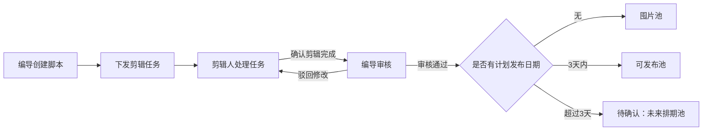

# 视频剪辑系统开发说明

## 1. 文档信息

- 来源：2026-08-11《智能纪要：视频剪辑系统功能讨论》
- 原始纪要：[飞书文档](https://rearogxjdi.feishu.cn/docx/U033dE1aeoKGokx69r1caEXCnOh?from=from_copylink)
- 目的：把会议中的业务规则转换为可开发、可验收的功能说明。
- 范围：脚本下发、剪辑回流、审核、库存池和发布前内容查看。

## 2. 核心业务目标

系统应管理一条视频从脚本建立到发布前入池的完整流转。每一步必须有明确的责任人、可查看的素材或内容链接、可追溯的操作时间，以及自动流转结果。

## 3. 角色与权限

| 角色 | 可执行操作 | 不能执行的操作 |
| --- | --- | --- |
| 编导 | 创建脚本、下发任务、查看剪辑结果、审核、填写修改意见、通过审核 | 不应代替其他剪辑人完成任务 |
| 剪辑人 | 查看分配给自己的任务、查看脚本、打开剪映素材链接、确认剪辑完成 | 不应审核或修改他人任务 |
| 管理员 | 管理人员、查看全局任务与库存、协助排期 | 不应绕过业务留痕直接改变流转状态 |

说明：会议中“审核端”由编导侧承接。如后续需要独立审核角色，应新增角色与权限矩阵，不能仅在前端隐藏按钮。

## 4. 功能规格

### 4.1 脚本建立与任务下发

编导新建脚本后，可直接创建剪辑任务。下发时至少填写：

- 剪辑人
- 剪映素材链接
- 计划交付时间

规则：

- 下发成功后，任务立即在对应剪辑人的工作台可见。
- 不设置“任务窗口自动关闭”或因时间到期导致任务不可操作的机制。
- 计划交付时间用于排序、提醒和逾期标记，不阻止剪辑人提交完成。
- 每次下发、改派或修改交付时间应记录操作者和时间。

验收：编导下发后，目标剪辑人刷新工作台即可看到任务、脚本摘要和可点击的剪映素材链接。

### 4.2 剪辑人工作台与完成回流

剪辑人进入自己的工作台后，应能：

- 查看待处理任务及计划交付时间。
- 查看关联脚本内容。
- 打开剪映素材链接。
- 填写或更新成片链接。
- 点击“确认剪辑完成”。

规则：

- “确认剪辑完成”后，任务自动回流到编导审核队列。
- 完成动作必须记录完成时间和操作人。
- 已完成任务不应继续出现在剪辑人的待处理列表中。
- 被驳回的任务重新回到原剪辑人的待处理列表，并显示修改意见和审核时间。

验收：剪辑人完成任务后，编导无需刷新之外的人工操作即可在审核队列看到该任务。

### 4.3 审核与修改意见

编导审核时必须能查看：

- 脚本与素材链接。
- 剪辑人提交的成片或相关链接。
- 历史审核记录和此前的修改意见。

审核意见支持两种留存方式：

- 优先方式：单条视频的独立飞书审核文档链接。
- 备选方式：直接填写文字修改意见。

规则：

- 驳回修改时，至少应提供飞书审核文档链接或文字修改意见之一。
- 驳回后，任务自动回到剪辑端；剪辑人可见本次意见。
- 审核通过时，记录审核人、审核时间和通过结果。
- 每轮驳回与重新提交均应保留，不能覆盖上一轮审核记录。

验收：同一任务可经历多轮“剪辑完成 -> 驳回修改 -> 再次完成”，且历史意见可追溯。

### 4.4 库存池分类

审核通过后，视频自动进入库存管理。库存池内必须可以查看视频内容或成片链接。

| 条件 | 归属 | 展示要求 |
| --- | --- | --- |
| 未设置计划发布日期 | 囤片池 | 显示审核通过时间、成片链接和后续排期入口 |
| 计划发布日期在当前日期起 3 个自然日内 | 可发布池 | 按发布日期和发布时间排序，突出即将发布内容 |
| 计划发布日期超过 3 天 | 待确认：未来排期池 | 当前会议未定义归属，需要产品确认 |

实现约定：

- “3 天内”按 Asia/Shanghai 时区和自然日计算，包含当天。
- 每次打开库存页都应按当前日期重新计算“可发布池”，避免日期跨天后数据仍停留在旧池。
- 库存池仅影响展示与运营管理，不应丢失视频原有审核和排期记录。

## 5. 数据与状态要求

建议为任务或关联实体保留下列数据：

| 数据 | 用途 |
| --- | --- |
| 脚本 ID、剪辑人 ID、创建人 ID | 建立责任归属 |
| 剪映素材链接 | 剪辑素材入口 |
| 成片链接 | 审核和库存内容查看 |
| 计划交付时间 | 工作台排序、提醒、逾期判断 |
| 计划发布日期、发布时间 | 库存分类和发布排期 |
| 当前流转状态 | 决定可见队列和允许操作 |
| 提交完成时间、审核时间 | 过程追溯和效率统计 |
| 审核轮次、审核意见、飞书审核文档链接 | 多轮修改留痕 |

状态变更应由服务端事务处理，确保“更新任务状态”和“创建或更新排期/库存记录”不会只成功其中一项。重复点击“审核通过”或重复保存排期时，应更新已有记录，而不是生成重复排期。

## 6. 页面与交互清单

| 页面 | 必须包含的内容 |
| --- | --- |
| 编导脚本库/任务下发页 | 脚本、新建任务、剪辑人选择、素材链接、计划交付时间 |
| 剪辑人工作台 | 我的待剪辑、脚本详情、素材链接、成片链接、确认完成按钮、驳回意见 |
| 编导审核队列 | 待审核任务、素材/成片链接、审核意见、飞书审核文档链接、通过与驳回操作 |
| 库存页 | 可发布池、囤片池、未来排期池（待确认）、内容查看和排期入口 |
| 任务详情页 | 当前状态、责任人、时间线、所有审核轮次和链接 |

## 7. 验收用例

1. 编导创建脚本并下发给指定剪辑人；剪辑人立刻可见任务，且即使超过计划交付时间仍可完成。
2. 剪辑人填写成片链接并确认完成；任务进入编导审核队列。
3. 编导填写修改意见后驳回；任务回到原剪辑人工作台，意见可见。
4. 剪辑人重新完成；编导通过后，未设置发布日期的视频进入囤片池。
5. 审核通过且发布日期为当天、次日或第 3 天的视频进入可发布池。
6. 库存池中可直接查看成片链接；任务详情可查看全部审核轮次。
7. 重复提交审核通过或重复保存同一排期，不产生重复排期记录。
8. 非任务责任人不能查看或操作不属于自己的剪辑任务；非编导不能执行审核。

## 8. 开发优先级

### P0：闭环可用

- 下发任务、剪辑完成、审核通过/驳回的完整状态流转。
- 剪映素材链接与成片链接的查看。
- 审核意见和飞书审核文档链接留存。
- 可发布池与囤片池自动分类。
- 服务端权限校验与操作留痕。

### P1：运营效率

- 计划交付提醒、逾期标识和待审核提醒。
- 任务详情时间线与审核历史。
- 库存池筛选、搜索和按发布时间排序。
- 审核通过后创建或更新排期的幂等处理。

### P2：待产品确认后实施

- 发布日期超过 3 天的视频具体归属与展示规则。
- 是否新增独立审核角色。
- 飞书审核文档是否需要系统自动创建，还是仅保存人工粘贴链接。
- 发布完成后的状态、数据归档和复盘指标。

## 9. 已知待确认项

1. 日期超过 3 天但已排期的视频，是否进入“未来排期池”，还是继续保留在囤片池？
2. “可发布池”的 3 天是否按自然日（本说明采用）还是精确 72 小时计算？
3. 审核飞书文档由谁创建，是否需要模板和自动关联？
4. 审核通过后是否必须立即设置发布日期，还是允许先进入囤片池？
5. 是否需要为不同编导、剪辑人配置独立的数据可见范围？
